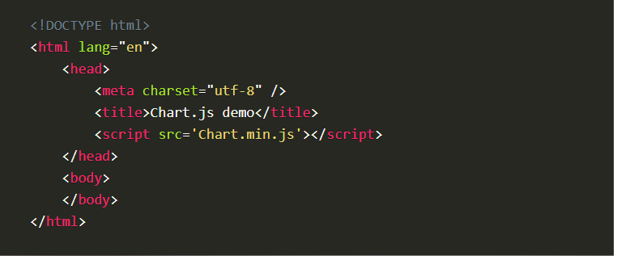
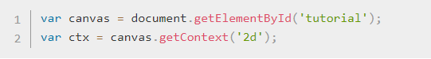
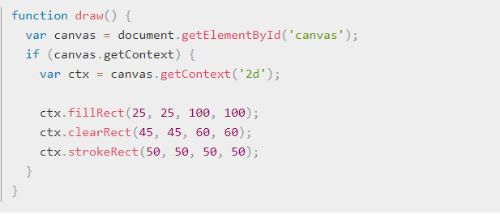
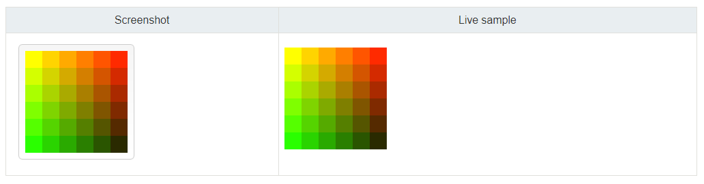
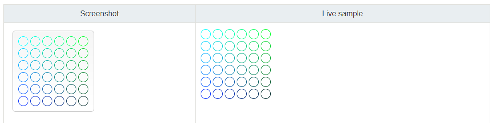
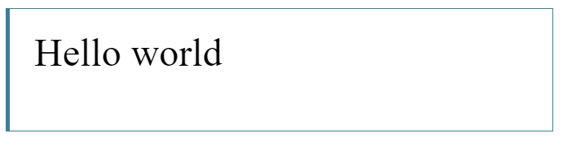
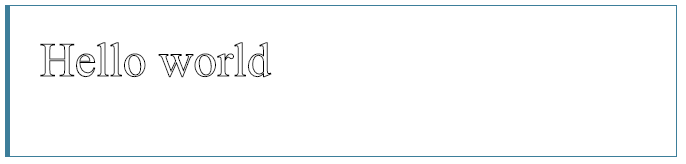

## Chart.js

**Charts.js is a JavaScript plugin that usess HTML5's `<canvas>` element to easily draw graphs and charts: Bar charts, line charts, pie charts and more.**

Setting up Charts.js:

1. Download Chart.js.
1. Copy Chart.min.js out of the unzipped folder.
1. Paste into active directory you'll be working in as a `<script>` (place above JS script).
1. Create new html page.
1. Import the script.

## Basic Usage of Canvas

**`<canvas>` looks like an image element without *src* or *alt* attributes. `<canvas>` tag should be placed within HTML content in order to render.**

`<canvas>` has only **two** attributes that are optional (default 300px x 150px):
- width
- height 

*Both attributes can be set up using DOM properties.*

> The `<canvas>` element can be styled like any normal image.

To display something on `<canvas>`, a **script** is required:

## Drawing Shapes with Canvas

`<canvas>` only supports **two** primitive shapes:

1. Rectangles
1. Paths - lists of points connected by lines.

- All other shapes must be created by combining one or more paths.

**There are 3 functions that draw rectangles in `<canvas>`:

> 1. `fillRect(x, y, width, height)` - Draws a filled rectangle.
> 1. `strokeRect(x, y, width, height)` - Draws a rectangular outline.
> 1. `clearRect(x, y, width, height)` - Clears rectangular area making it transparent. 

Rectangular shape example:

### Drawing Paths

1. Create the path.
1. Use the drawing commands to draw into the path.
    - [Drawing Commands](https://developer.mozilla.org/en-US/docs/Web/API/CanvasRenderingContext2D#Paths)
1. Once path is created, **stroke** or **fill** the path to render it.  

Functions used to perform drawing paths:

> **beginPath()**
Creates a new path. Once created, future drawing commands are directed into the path and used to build the path up.

> **closePath()**
Adds a straight line to the path, going to the start of the current sub-path.

> **stroke()**
Draws the shape by stroking its outline.

> **fill()**
Draws a solid shape by filling the path's content area.

> **moveTo(x, y)**
Moves to the coordinates specified by x and y.

> **lineTo(x, y)**
Draws a line from the current drawing position to the position specified by x and y.

> **rect(x, y, width, height)**
Draws a rectangle whose top-left corner is specified by (x, y) with the specified width and height.

## Applying Styles and Colors with Canvas

**Adding colors to a shape have *two* important properties:**

> **fillStyle = color**
Sets the style used when filling shapes.

> **strokeStyle = color**
Sets the style for shapes' outlines.

### Line Styles

> **lineWidth** = value
Sets the width of lines drawn in the future.

> **lineCap** = type
Sets the appearance of the ends of lines.

> **lineJoin** = type
Sets the appearance of the "corners" where lines meet.

> **miterLimit** = value
Establishes a limit on the miter when two lines join at a sharp angle, to let you control how thick the junction becomes.

> **getLineDash()**
Returns the current line dash pattern array containing an even number of non-negative numbers.

> **setLineDash(segments)**
Sets the current line dash pattern.

> **lineDashOffset** = value
Specifies where to start a dash array on a line.

## Drawing Text with Canvas

**Canvas provides two methods to render text:**

> **fillText(text, x, y [, maxWidth])**
Fills a given text at the given (x,y) position. 

> **strokeText(text, x, y [, maxWidth])**
Strokes a given text at the given (x,y) position. 

### Styling Text

**Properties that adjust the way text gets displayed:**

> **font** = value
The current text style being used when drawing text. This string uses the same syntax as the CSS font property. The default font is 10px sans-serif.

> **textAlign** = value
Text alignment setting. Possible values: start, end, left, right or center. The default value is start.

> **textBaseline** = value
Baseline alignment setting. Possible values: top, hanging, middle, alphabetic, ideographic, bottom. The default value is alphabetic.

> **direction** = value
Directionality. Possible values: ltr, rtl, inherit. The default value is inherit.

[<== Back to Main Readme](README.md)