## CSS Transforms

*CSS3 introduced the **transform** property, a new set of layout techniques with alternative ways to **size**, **position**, and **change elements**. 

- The **transform** property has two different settings with specific individual properties and values:
    - **Two-Dimensional** - Alter elements on the **x** and **y** axis, length and width.
    - **Three-Dimensional** - Alter elements on the **x**, **y** and **z** axis, length, width and depth.

*The **transform** property has the following 2D and 3D values:*

- **rotate** - Rotate an element from 0 to 360 degrees.
- **scale** - Change the appeared size of an element.
- **translate** - Pushing and pulling an element in different directions without interrupting the normal flow of the page.
- **skew** - Used to distort elements.

*It is possible and common to utilize multiple transform properties.*

## Transitions & Animations

*CSS3 allows the appearance and behavior of an element to be altered without the use of JavaScript.*

- Transitions occur when an element is hovered over, focused on, active or targeted.

- Animations alter an element in multiple keyframes. It can set multiple points of transition upon different keyframes.

### Transitions

**Transitional Property - Determines exactly what properties will be altered. Only the properties within the transition-property will be affected.**

- Examples of the more popular transitional properties:

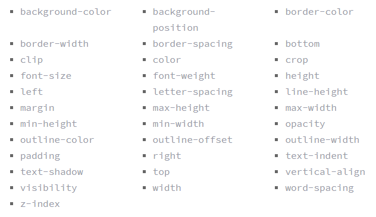

*Other transitional properties include:

- **Transition Duration** - The duration in which a transition takes place using *general timing values*.

- **Transition Timing** - Used to set the speed in which a transition moves.

- **Transition Delay** - Sets a time value that specifies how long a transition should wait before executing.

*Shorthand Transitions - Use a comma to separate each of the transition values. See example below:

> `transition: background .2s linear, border radius- 1s ease-in 2sec;`

*Enter shorthand in the following order:*

1. transition-property
1. transition-duration
1. transition-timing-function
1. transition-delay

### Animations

**@keyframes rule** - To set multiple points when an element should undergo a transition. This includes:

- The **animation name**.
- Any **animation breakpoints**.
- **Properties** intended to be animated.

*Once the keyframes for an animation have been declared, they need to be assigned to an element by assigning  an **animation name**, this name will be the animation name **value***

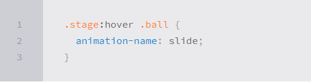

*Following the name, an **animation-duration** must be declared in order to specify how long an animation should take to complete.*

- The following properties may also be used with animations:
    - **animation-timing-function**
    - **animation-delay**

**Customizing Animations**

*Further animation customizations:*

- **animation-iteration-count** - To have an animation repeat itself numerous times. Values would be an **integer** or the word **infinite**.

- **animation-direction** - To declare the directon of an animation. Values include **normal**, **reverse**, **alternate** and **alternate-reverse**.

- **animation-play-state** - Allows an animation to be played or paused. Values are **running** and **paused**.

- **animation-fill-mode** - Identifies how an element should be styled before, after or before and after an animation. Values are **none**, **forwards**, **backwards** and **both**.

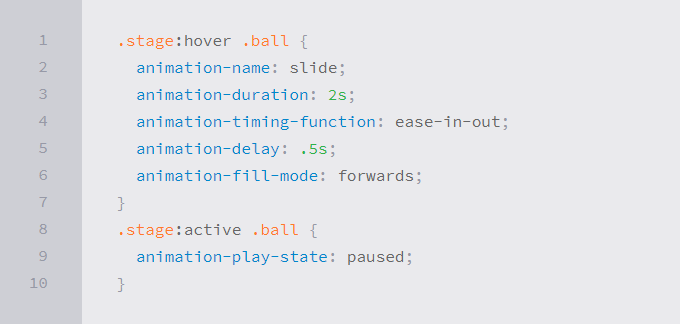

*Animation shorthand should go in the following order:*
1. animation-name
1. animation-duration
1. animation-timing-function
1. animation-delay
1. animation-iteration-count
1. animation-direction
1. animation-fill-mode
1. animation-play-state

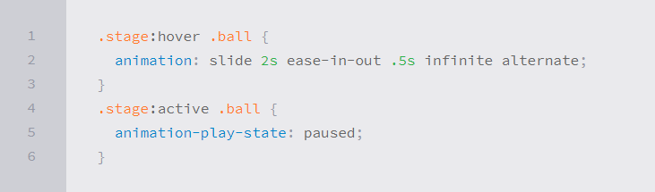

## 8 Simple CSS3 Transitions That Will Wow Users

1. **Fade In**

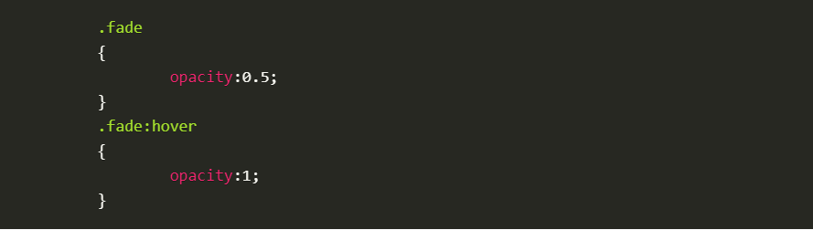

1. **Change Color**

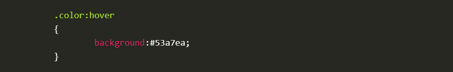

1. **Grow & Shrink**

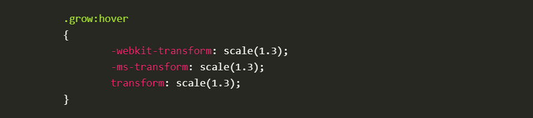
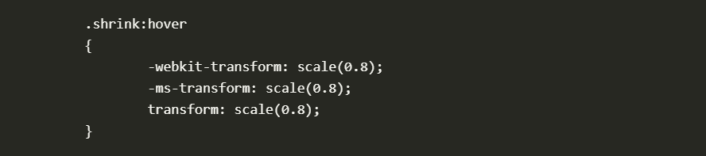

1. **Rotate Elements**

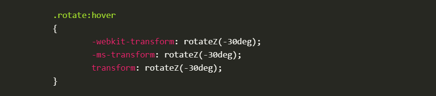

1. **Square to Circle**

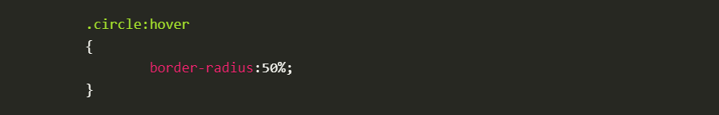

1. **3D Shadow**

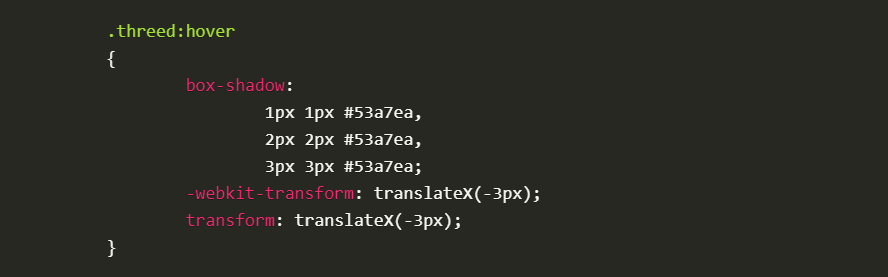

1. **Swing**

1. **Inset Border**

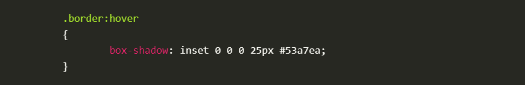

[<== Back to Main Readme](README.md)

