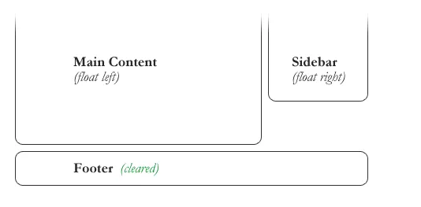
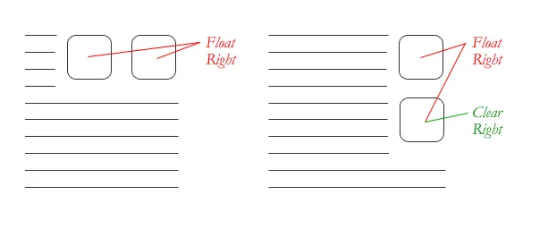
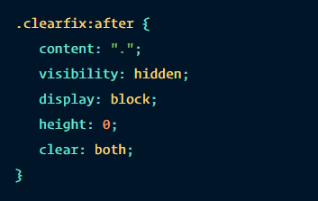

## Responsive Web Design

**Building a website suitable wo work on every device and screen size, large or small, mobile or desktop.**

**Currently the most popular technique:**
1. Adapts to different browser and device viewports.
1. Dynamically changes layout and content.
1. Benefits of being responsive, adaptive and moble. 

Three main components:

### Flexible Layouts 

 - Flexible grid capable of resizing to any width using relative length units, commonly **percentages** or **em units**.

> Formula to identify proportions:
> Target Width of an Element divided by Parent Element's Width  = Relative Width

To be entered in the head of HTML:

> `<meta name="viewport" content="width=device-width, initial-scale=1">`

### Media Queries 

`@media only scren and (max-width:000px){`
  `//put CSS rules for devices with a max width of 500px`
`}`

- Provide the ability to specify different styles for individual browser and device circumstances, example would be device orientation.
    - Able to uniquely apply **targeted styles**.
    - **@media rule** recommended for use inside an existing style sheet.
    - **Logical Operators** - used to build powerful expressions:
          - *and*, *not*, *only*
    - **Media Features** - Identify attributes or properties that will be targeted, most commonly *height* or *width* of a device or browser.
          - *orientation* feature - landscape or portrait.
          - *aspect-ratio* and *device-aspect-ratio* - specifies width and height pixel ratio of targeted area.
          - *resolution* - determines pixel density.
          - *color*, *color-index* and *monochrome* features.

> Mobile First Approach - using styles targeted at smaller viewports as default for a website, then add as the viewport grows.

### Flexible Media

- Ability for images, videos and other media types to be scaleable, changing size as the viewport size changes.
    - **max-width property** - Value of 100% to ensure any media will scale down.
    - **flexible embedded media** - Utilizing absolute positioning of an embedded element in a parent element set at 100% width.

## All About Floats

**Float is a CSS positioning property where images are set into the page allowing text to wrap around as needed.**

There are four valid *float* property values:
1. Left
1. Right
1. None
1. Inherit - Assume the float value from the parent element.

*Text will reflow to accomodate any change in image size.*

**Clear** Property - An element with this property will move itself down below the floated elements.

There are four valid *clear* property values:
1. Both - Clears floats coming from either direction
1. Left 
1. Right 
1. None

Techniques for Clearing Floats:

  - **The Empty Div Method** - `

`
  - **The Overflow Method** - Setting the overflow CSS property on a parent element.
  - **The Easy Clearing Method** - Uses CSS pseudo selector `:after`:

[<== Back to Main Readme](README.md)