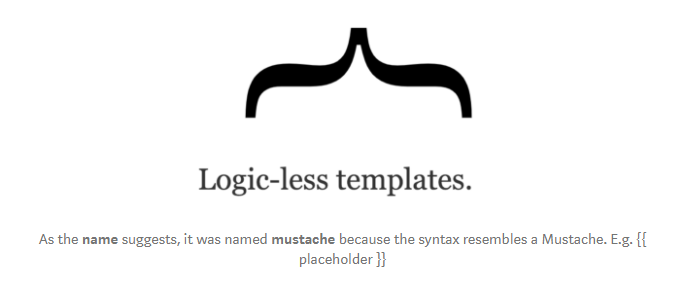
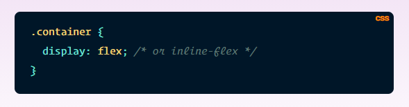

## JavaScript Templating

- Templating is a fast and efficient technique to create JavaScript templates using a JSON data source. 

- The template is HTML markup with tags that will insert variables of run programming logic. 

- The template engine replaces declared variables and instances with actual values and converts the template into an HTML file. 

- Mustache is template syntax used for HTML, config fules, source code, etc. Expands tags and uses values provided in hash or object.

- Referred as "logic-less" because there are no:
  - "if" statements
  - "else" clauses
  - "for" loops

- Only uses tags replaced with:
  - values
  - sometimes nothing
  - series of values

## A Complete Guide to Flexbox

**CSS flexbox layout has many different properties that affect the:**
  - Parent Element - The flex container.
  - Child Elements - The flex items.

> Properties for the **Parent** (flex container):

- **display** - Defines the flex container as inline or block. Enables flex content for all direct children. 

- **flex-direction** - Defines the direction items are placed in the container, horizontal or vertical.
    - row - (default) left to right.
    - row-reverse - right to left.
    - column - top to bottom.
    - column-reverse - bottom to top.

- **flex-wrap** - By default, all items will try to fit on one line. This allows the items to wrap as needed.
    - nowrap - (default) all on one line.
    - wrap - wrap onto multiple lines from top to bottom.
    - wrap-reverse - wrap onto multiple lines from botton to top.

- **flex-flow** - Shorthand for flex-direction and flex-wrap. Default value is row nowrap.

- **justify-content** - Defines alignment along the main axis. Helps to distribute extra free leftover space.
    - flex-start - (default) items are packed toward the start.
    - flex-end - items are packed toward the end.
    - left - items packed toward left edge of container.
    - right - items packed toward right edge of container.
    - center - items are centered.
    - space-between - evenly distributed in the line.
    - space-around - evenly distributed with equal space around them.
    - space-evenly - distributed so spacing between items are equal.

- **align-items** - Defines the behvior of how items are laid out.
    - stretch - (default) stretch to fill the container.
    - flex-start - placed at the start of the cross axis.
    - flex-end - placed at the end of the cross axis.
    - center - centered in the cross axis.
    - baseline - items baselines align.

- **align-content** - Aligns a containers lines within when there is extra space in the cross axis.
    - flex-start - packed to the start of the container.
    - flex-end - packed to the end of the container.
    - center - items centered in container.
    - space-between - items evenly distributed.
    - space-around - evenly distributed with equal space between each line.
    - space-evenly - distributed with equal space around them.
    - stretch - (default) stretch to take up the remaining space.

> Properties for the **Children** (flex items):

- **order** - Controls the order of appearance within a container.
- **flex-grow** - Defines ability for an item to grow if necessary. Dictates how much space an item should take up.
- **flex-shrink** - Defines ability for a flex item to shrink if needed.
- **flex-basis** - Defines the default size of an element before the remaining space is distributed.
- **flex** - Shorthand for flex-grow, flex-shrink and flex-basis.
- **align-self** - Allows the default alignment to be overridden for individual flex items.

**NOTE:** Float, clear and vertical-align have no effect on a flex item.

[<== Back to Main Readme](README.md)