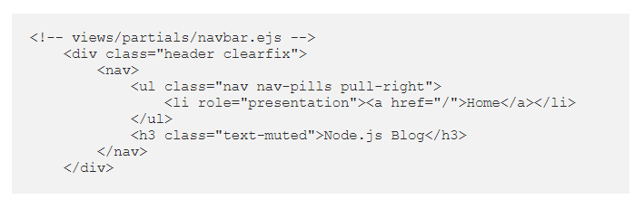
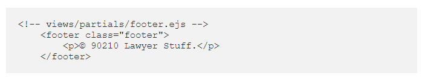

## EJS Partials

- Partials come in handy when you want to reuse the same HTML across multiple views. Are very useful for:
    - Navigation Bars
    - Footers
    - Reuseable piece of text that remains static.

- Partials make large websites easier to maintain. 

- Define the reusable bundle of code and include where needed.

- Partials are created and found in the following .ejs folder:
> views/partials 

- Create a file that will contain only the HTML bundle of reusable code:
> `<!-- views/partials/navbar.ejs -->`
    - or
> `<!-- views/partials/footer.ejs -->`

[<== Back to Main Readme](README.md)